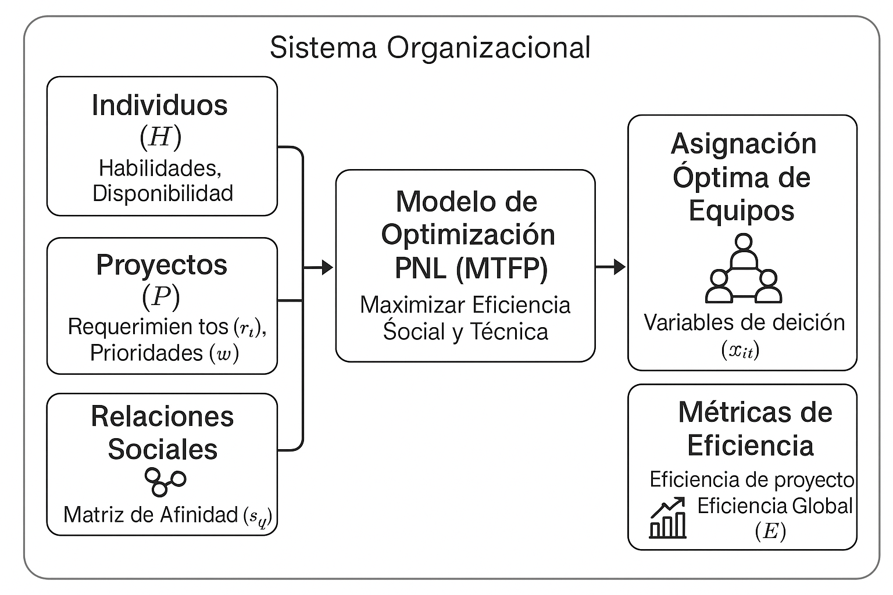

# **Formación de Equipos Múltiples con Sociometría**

**Ignacio Martínez Hernández**  
Doctorado en Sistemas de Ingeniería  
Universidad de Talca
[martinez17@alumnos.utalca.cl](mailto:imartinez17@alumnos.utalca.cl)

**Código Fuente:**  
[github.com/DarkNacho/Multiple-Team-Formation](https://github.com/DarkNacho/Multiple-Team-Formation)

---

## **Motivación**

- Las organizaciones deben asignar personas a múltiples proyectos simultáneamente.
- No basta con cubrir lo técnico:  
  ¡La dinámica social importa!
- ¿Cómo lograr equipos eficientes y cohesionados?

---

## **Objetivo**

- Asignar personas a proyectos maximizando:
    - **Eficiencia técnica**
    - **Afinidad social**
- Proveer una herramienta formal y flexible para la toma de decisiones.

---

## **Metodología**

1. **Definición formal del problema**  
2. **Generación de datos sintéticos**  
3. **Implementación computacional**  
4. **Análisis experimental y validación**

---

## **Simplificaciones del Modelo**

- Cada persona tiene **una** habilidad principal.
- Asignaciones de tiempo **discretas** (ej: 0%, 50%, 100%).
- Relaciones sociales **fijas** durante la asignación.
- Proyectos **independientes** y con prioridad.

---

## **Componentes del Problema**

- **Individuos ($\mathcal{H}$):** habilidades y afinidades sociales.
- **Proyectos ($\mathcal{P}$):** requieren habilidades y tienen prioridad.
- **Habilidades ($\mathcal{K}$):** tipos de competencias técnicas.
- **Asignación ($x_{il}$):** ¿Quién va a qué proyecto y cuánto tiempo?

---

## **Definición Formal del Modelo**

**Conjuntos:**
- $\mathcal{H}$: Conjunto de individuos ($i$)
- $\mathcal{P}$: Conjunto de proyectos ($l$)
- $\mathcal{K}$: Conjunto de habilidades ($a$)
- $\mathcal{D}$: Fracciones de tiempo permitidas

---

## **Definición Formal del Modelo**

**Parámetros:**
- $s_{ij}$: Afinidad social entre $i$ y $j$ ($+1$, $0$, $-1$)
- $r_{al}$: Requerimiento de habilidad $a$ en proyecto $l$
- $w_l$: Peso o prioridad del proyecto $l$

**Variables:**
- $x_{il}$: Fracción de tiempo de $i$ asignada a $l$ ($x_{il} \in \mathcal{D}$)

---

## **Función Objetivo**

**Eficiencia de cada proyecto:**
$$
e_l = \frac{1}{2} \left( 1 + \frac{\sum_{i,j \in \mathcal{H}} s_{ij} x_{il} x_{jl}}{\left(\sum_{a \in \mathcal{K}} r_{al}\right)^2} \right)
$$

**Eficiencia global a maximizar:**
$$
\max E = \sum_{l \in \mathcal{P}} w_l \cdot e_l
$$

---

## **Interpretación de la Función Objetivo**

- **Numerador:** Suma de afinidades ponderada por la colaboración conjunta.
- **Denominador:** Normaliza por el tamaño del proyecto.
- **Resultado:** Índice de cohesión entre 0 y 1, ponderado por prioridad.

---

## **Restricciones del Modelo**

1. **Capacidad individual:**
   $$
   \sum_{l \in \mathcal{P}} x_{il} \leq 1 \quad \forall i \in \mathcal{H}
   $$
2. **Requerimientos de habilidad:**
   $$
   \sum_{i \in Q_a} x_{il} = r_{al} \quad \forall a \in \mathcal{K}, \forall l \in \mathcal{P}
   $$
3. **Asignación discreta:**
   $$
   x_{il} \in \mathcal{D}
   $$

---

## **Visualización del Modelo**

---

## **Implementación Computacional**

- **Lenguaje:** Python
- **Modelado:** Pyomo
- **Solver:** Bonmin (MINLP)
- **Datos:** Archivos JSON configurables

---

## **Resultados: Validación de Correctitud**

- Comparación entre el modelo MINLP y fuerza bruta en instancias pequeñas.

| Instancia                   | Eficiencia Global (Fuerza Bruta) | Eficiencia Global (Solver) |
| --------------------------- | :------------------------------: | :------------------------: |
| 2p / 1pr / 1sk (afin. pos)  |             100.00%              |          100.00%           |
| 3p / 2pr / 2sk (afin. mix)  |             100.00%              |          100.00%           |
| 4p / 2pr / 2sk (afin. nega) |              75.00%              |           75.00%           |
| 6p / 1pr / 2sk (excedente)  |              75.00%              |           75.00%           |

*El modelo es correcto y coincide con la solución óptima.*

---

## **Resultados: Escalabilidad**

- Evaluación del tiempo de resolución y eficiencia global al aumentar el tamaño del problema.

| Instancia         | Eficiencia Global | Tiempo (s) |
| ----------------- | :---------------: | :--------: |
| 10p / 2pr / 2sk   |      81.90%       |    0.22    |
| 20p / 5pr / 4sk   |      75.11%       |    0.84    |
| 30p / 5pr / 4sk   |      60.22%       |    5.05    |
| 50p / 10pr / 8sk  |      73.65%       |   45.11    |
| 100p / 10pr / 8sk |      67.86%       |   622.19   |

*El modelo resuelve instancias realistas en tiempos razonables.*

---

## **Resultados: Impacto de la Discretización del Tiempo**

- Comparación de eficiencia y tiempos de cómputo según la granularidad de las fracciones de tiempo.

| Fracciones Permitidas   | Eficiencia Global | Tiempo Solver (s) | Tiempo Fuerza Bruta (s) |
| ----------------------- | :---------------: | :---------------: | :---------------------: |
| {0, 1}                  |      88.89%       |       0.18        |          0.04           |
| {0, 0.5, 1}             |      88.89%       |       0.13        |          3.56           |
| {0, 0.25, 0.5, 0.75, 1} |      88.89%       |       0.13        |         1407.97         |

*El solver es eficiente incluso con mayor granularidad, a diferencia de fuerza bruta.*

---

## **Resultados: Robustez ante Afinidades Negativas**

- Eficiencia global al aumentar la proporción de afinidades negativas.

| Proporción Negativas | Eficiencia Global |
| -------------------: | ----------------: |
|                  50% |            55.56% |
|                  60% |            38.89% |
|                  80% |            33.33% |
|                  90% |            22.22% |
|                 100% |            22.22% |

*El modelo penaliza fuertemente los equipos con alta conflictividad.*

---

## **Resultados: Sensibilidad a la Prioridad de Proyectos**

- El modelo responde correctamente a los pesos asignados a los proyectos.

| Pesos (P1, P2) | Eficiencia P1 | Eficiencia P2 | Eficiencia Global |
| :------------: | :-----------: | :-----------: | :---------------: |
|   (80%, 20%)   |    88.89%     |    77.78%     |      86.67%       |
|   (95%, 5%)    |    88.89%     |    77.78%     |      88.33%       |

*La eficiencia global ponderada aumenta al priorizar proyectos más cohesionados.*

---

## **Gestión de Casos Inviables**

- Si no hay suficientes personas:
    - El modelo estricto reporta "inviable".
    - Se activa un **modelo relajado**:
        - Permite déficit de habilidades.
        - Penaliza fuertemente el déficit en la función objetivo.

---

## **Definición Formal del Modelo Relajado**

- Se introducen variables de déficit $\delta_{al} \geq 0$.
- Restricción de habilidad relajada:
  $$
  \sum_{i \in Q_a} x_{il} + \delta_{al} = r_{al}
  $$
- Nueva función objetivo:
  $$
  \max E_{\text{relajado}} = \left( \sum_{l \in \mathcal{P}} w_l \cdot e_l \right) - \lambda \sum_{l \in \mathcal{P}} \sum_{a \in \mathcal{K}} \delta_{al}
  $$

---

## **Resultados: Modelo Relajado en Instancias Inviables**

- El modelo relajado informa el déficit de habilidades y la eficiencia alcanzada.

| Instancia       | Eficiencia Global | Déficit Total |
| --------------- | :---------------: | :-----------: |
| 4p / 2pr / 2sk  |      66.39%       |      3.0      |
| 6p / 2pr / 2sk  |      54.32%       |     12.0      |
| 10p / 3pr / 2sk |      79.93%       |      1.5      |
| 15p / 4pr / 5sk |      66.80%       |      3.0      |

*El modelo no falla: entrega la mejor asignación posible y cuantifica el déficit.*

---

## **Utilidad para la Gestión**

- Herramienta de diagnóstico y apoyo a la decisión.
- Identifica exactamente qué falta y dónde.
- Ayuda a priorizar acciones en recursos humanos y proyectos.

---

## **Conclusiones**

- El modelo permite formar equipos eficientes y cohesionados.
- Es robusto ante conflictos y escalable a problemas reales.
- La gestión de inviabilidad es una contribución clave.

---

## **Trabajo Futuro**

- Incluir habilidades secundarias y penalizar sobreasignación.
- Mejorar la matriz de afinidad para capturar más factores.
- Probar otros solvers o heurísticas para problemas aún más grandes.

---

# **Formación de Equipos Múltiples con Sociometría**

**Ignacio Martínez Hernández**  
Doctorado en Sistemas de Ingeniería  
Universidad de Talca
[martinez17@alumnos.utalca.cl](mailto:imartinez17@alumnos.utalca.cl)

**Código Fuente:**  
[github.com/DarkNacho/Multiple-Team-Formation](https://github.com/DarkNacho/Multiple-Team-Formation)

